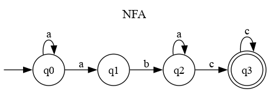
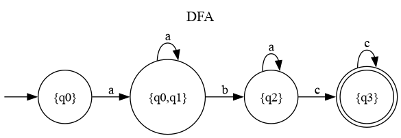

# Determinism in Finite Automata. Conversion from NDFA to DFA. Chomsky Hierarchy.

### Course: Formal Languages & Finite Automata
### Author: Poiata Calin

----

## Theory

A **finite automaton** (FA) is a mechanism used to represent processes of different kinds, comparable to a state machine. The word *finite* signifies that the automaton has a starting state and a set of final (accept) states — every modeled process has a beginning and an ending. An FA is formally defined by five components: a set of states (Q), an input alphabet (Σ), a transition function (δ), a start state (q₀), and a set of accept states (F).

Based on the structure of the transition function, an automaton can be **deterministic** (DFA) or **non-deterministic** (NFA). In a DFA, each (state, symbol) pair maps to exactly one next state, making the system fully predictable. In an NFA, a single (state, symbol) pair can lead to multiple next states, introducing non-determinism. Despite this difference, DFAs and NFAs are equivalent in expressive power — every NFA can be converted into a DFA that recognizes the same language, using the **subset construction** algorithm.

The **Chomsky hierarchy** classifies formal grammars into four types based on the form of their production rules: Type 0 (unrestricted), Type 1 (context-sensitive), Type 2 (context-free), and Type 3 (regular). Regular grammars (Type 3) are the most restrictive and correspond directly to finite automata.


## Objectives:

* Provide a function in the grammar class that classifies the grammar based on the Chomsky hierarchy.
* Implement conversion of a finite automaton to a regular grammar.
* Determine whether the FA is deterministic or non-deterministic.
* Implement functionality to convert an NFA to a DFA.
* Represent the finite automaton graphically using Graphviz.


## Implementation description

### Chomsky Hierarchy Classification

The `classify_chomsky()` method in the `Grammar` class examines every production rule and checks three boolean flags — `is_regular`, `is_context_free`, and `is_context_sensitive` — to determine the grammar type. For Type 3 (regular), every left-hand side must be a single non-terminal, and every right-hand side must be either a single terminal or a terminal followed by a non-terminal (right-linear form). For Type 2 (context-free), only the single non-terminal LHS constraint is required. For Type 1 (context-sensitive), the RHS must be at least as long as the LHS. If none of these hold, it falls back to Type 0 (unrestricted).

```python
def classify_chomsky(self):
    is_regular = True
    is_context_free = True
    is_context_sensitive = True

    for lhs, rhs_list in self.productions.items():
        if len(lhs) != 1 or lhs not in self.vn:
            is_context_free = False
            is_regular = False

        for rhs in rhs_list:
            if len(rhs) < len(lhs):
                is_context_sensitive = False

            if is_regular:
                if len(rhs) == 1:
                    if rhs not in self.vt:
                        is_regular = False
                elif len(rhs) == 2:
                    if rhs[0] not in self.vt or rhs[1] not in self.vn:
                        is_regular = False
                else:
                    is_regular = False

    if is_regular:
        return "Type 3 (Regular)"
    elif is_context_free:
        return "Type 2 (Context-Free)"
    elif is_context_sensitive:
        return "Type 1 (Context-Sensitive)"
    else:
        return "Type 0 (Unrestricted)"
```

When run on the Variant 21 grammar from Lab 1, it correctly identifies it as **Type 3 (Regular)**, since all productions are of the form `A → a` or `A → aB`.

### FA to Regular Grammar Conversion

The `to_regular_grammar()` method converts a finite automaton back into a regular grammar. Every state becomes a non-terminal. For each transition δ(A, a) = B, a production `A → aB` is created. Additionally, if B is an accept state, a production `A → a` is also added to allow the derivation to terminate. This dual handling is needed because an accept state may still have outgoing transitions (e.g., q3 with a self-loop on `c`), so both `A → aB` and `A → a` must be present to preserve the full language.

```python
def to_regular_grammar(self):
    from grammar import Grammar

    vn = set(self.states)
    vt = set(self.alphabet)
    productions = {}

    for (state, symbol), targets in self.transitions.items():
        for target in targets:
            productions.setdefault(state, []).append(symbol + target)
            if target in self.accept_states:
                productions.setdefault(state, []).append(symbol)

    return Grammar(vn, vt, productions, self.start_state)
```

### Determinism Check

The `is_deterministic()` method iterates over all transition entries and checks whether any (state, symbol) pair maps to more than one target state. If so, the automaton is non-deterministic.

```python
def is_deterministic(self):
    for (state, symbol), targets in self.transitions.items():
        if len(targets) > 1:
            return False
    return True
```

For the Variant 21 FA, `δ(q0, a) = {q0, q1}` maps to two states, so the method correctly returns `False` — the automaton is an NFA.

### NFA to DFA Conversion (Subset Construction)

The `to_dfa()` method implements the subset construction algorithm. Each DFA state is a frozenset of NFA states. Starting from `{q0}`, the algorithm processes each symbol by collecting all NFA states reachable from the current set and creating a new DFA state for each unique combination. A DFA state is accepting if it contains any NFA accept state. Finally, states are renamed from frozenset representations to readable strings like `{q0,q1}`.

```python
def to_dfa(self):
    dfa_start = frozenset({self.start_state})
    dfa_states = set()
    dfa_transitions = {}
    queue = [dfa_start]
    dfa_states.add(dfa_start)

    while queue:
        current = queue.pop(0)

        for symbol in self.alphabet:
            next_state = set()
            for nfa_state in current:
                key = (nfa_state, symbol)
                if key in self.transitions:
                    next_state |= self.transitions[key]

            if not next_state:
                continue

            next_frozen = frozenset(next_state)
            dfa_transitions[(current, symbol)] = {next_frozen}

            if next_frozen not in dfa_states:
                dfa_states.add(next_frozen)
                queue.append(next_frozen)

    dfa_accept = set()
    for state in dfa_states:
        if state & self.accept_states:
            dfa_accept.add(state)

    # Rename states to readable strings
    state_names = {}
    for state in sorted(dfa_states, key=lambda s: sorted(s)):
        name = "{" + ",".join(sorted(s for s in state)) + "}"
        state_names[state] = name

    renamed_states = {state_names[s] for s in dfa_states}
    renamed_transitions = {}
    for (state, symbol), targets in dfa_transitions.items():
        renamed_targets = {state_names[t] for t in targets}
        renamed_transitions[(state_names[state], symbol)] = renamed_targets
    renamed_accept = {state_names[s] for s in dfa_accept}
    renamed_start = state_names[dfa_start]

    return FiniteAutomaton(
        renamed_states, set(self.alphabet),
        renamed_transitions, renamed_start, renamed_accept,
    )
```

### Graphical Representation

The `draw_automaton()` function in `visualize.py` uses the Graphviz library to render a finite automaton as a directed graph. Accept states are drawn as double circles, regular states as single circles, and an invisible node provides the entry arrow to the start state. Transitions sharing the same source and target are merged into a single edge with a comma-separated label.

```python
from graphviz import Digraph

def draw_automaton(fa, title, filename):
    dot = Digraph(comment=title)
    dot.attr(rankdir="LR", label=title, fontsize="16", labelloc="t")

    dot.node("", shape="none", width="0", height="0")
    dot.edge("", fa.start_state)

    for state in sorted(fa.states):
        if state in fa.accept_states:
            dot.node(state, shape="doublecircle")
        else:
            dot.node(state, shape="circle")

    edge_labels = {}
    for (state, symbol), targets in fa.transitions.items():
        for target in targets:
            key = (state, target)
            edge_labels.setdefault(key, []).append(symbol)

    for (src, dst), symbols in sorted(edge_labels.items()):
        label = ", ".join(sorted(symbols))
        dot.edge(src, dst, label=label)

    dot.render(filename, format="png", cleanup=True)
```

### Main Driver (Lab 2 section)

The Lab 2 section of `main.py` defines the Variant 21 finite automaton directly, then runs all tasks in sequence: Chomsky classification of the Lab 1 grammar, FA-to-grammar conversion, determinism check, NFA-to-DFA conversion with verification, and graphical output.

```python
fa = FiniteAutomaton(
    states={"q0", "q1", "q2", "q3"},
    alphabet={"a", "b", "c"},
    transitions={
        ("q0", "a"): {"q0", "q1"},
        ("q1", "b"): {"q2"},
        ("q2", "c"): {"q3"},
        ("q3", "c"): {"q3"},
        ("q2", "a"): {"q2"},
    },
    start_state="q0",
    accept_states={"q3"},
)
```


## Conclusions / Results

The program was executed successfully. Below is the output from the Lab 2 section:

```
1. Chomsky classification of Lab 1 grammar: Type 3 (Regular)

Variant 21 Finite Automaton:
  States:        {'q1', 'q2', 'q3', 'q0'}
  Alphabet:      {'a', 'b', 'c'}
  Start state:   q0
  Accept states: {'q3'}
  Transitions:
    δ(q0, a) = {'q1', 'q0'}
    δ(q1, b) = {'q2'}
    δ(q2, a) = {'q2'}
    δ(q2, c) = {'q3'}
    δ(q3, c) = {'q3'}

2a. FA → Regular Grammar conversion:
  V_N = {'q1', 'q2', 'q3', 'q0'}
  V_T = {'a', 'b', 'c'}
  Start = q0
  Productions:
    q0 → aq1
    q0 → aq0
    q1 → bq2
    q2 → cq3
    q2 → c
    q2 → aq2
    q3 → cq3
    q3 → c

2b. Is the FA deterministic? No (NFA)

2c. NFA → DFA conversion:
  States:        {'{q3}', '{q0}', '{q0,q1}', '{q2}'}
  Alphabet:      {'a', 'b', 'c'}
  Start state:   {q0}
  Accept states: {'{q3}'}
  Transitions:
    δ({q0,q1}, a) = {'{q0,q1}'}
    δ({q0,q1}, b) = {'{q2}'}
    δ({q0}, a) = {'{q0,q1}'}
    δ({q2}, a) = {'{q2}'}
    δ({q2}, c) = {'{q3}'}
    δ({q3}, c) = {'{q3}'}

  Is the converted FA deterministic? Yes (DFA)

  Verification (DFA should match NFA results):
    'abc' -> NFA=accepted, DFA=accepted ✓
    'aabc' -> NFA=accepted, DFA=accepted ✓
    'abaac' -> NFA=accepted, DFA=accepted ✓
    'abcc' -> NFA=accepted, DFA=accepted ✓
    'abaccc' -> NFA=accepted, DFA=accepted ✓
    'ab' -> NFA=rejected, DFA=rejected ✓
    'aac' -> NFA=rejected, DFA=rejected ✓
    'bc' -> NFA=rejected, DFA=rejected ✓
    'b' -> NFA=rejected, DFA=rejected ✓
    'abcb' -> NFA=rejected, DFA=rejected ✓

2d. Graphical representation:
Saved nfa_graph.png
Saved dfa_graph.png
```

The Variant 21 grammar from Lab 1 is correctly classified as **Type 3 (Regular)** in the Chomsky hierarchy.

The Variant 21 finite automaton is correctly identified as **non-deterministic** because δ(q0, a) leads to two states: {q0, q1}. The FA-to-grammar conversion produces a valid right-linear grammar that preserves the language, including the self-loop on the accept state q3.

The NFA-to-DFA conversion via subset construction produces a 4-state DFA. The merged state {q0, q1} handles the non-determinism of the original q0. Verification confirms that the DFA accepts and rejects exactly the same strings as the NFA.

The generated graphs are shown below:

**NFA (Variant 21):**



**DFA (Variant 21):**


